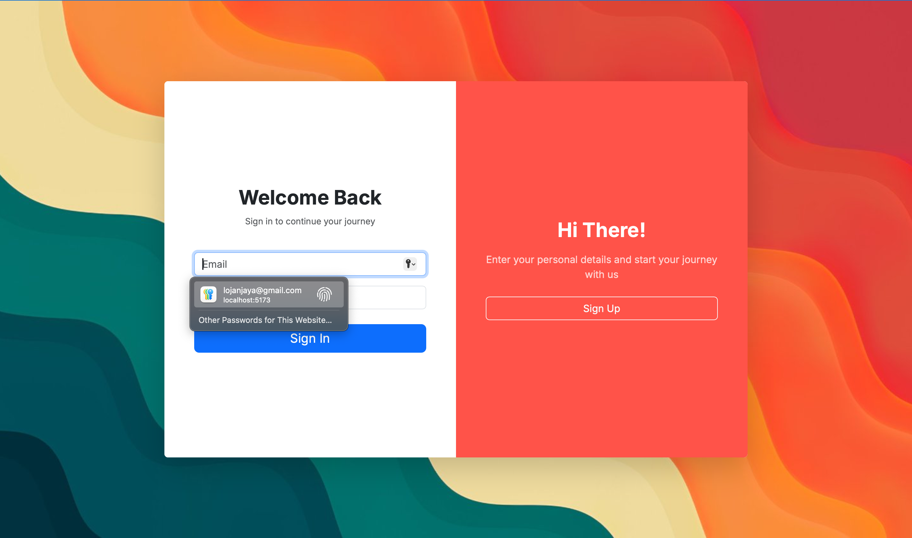
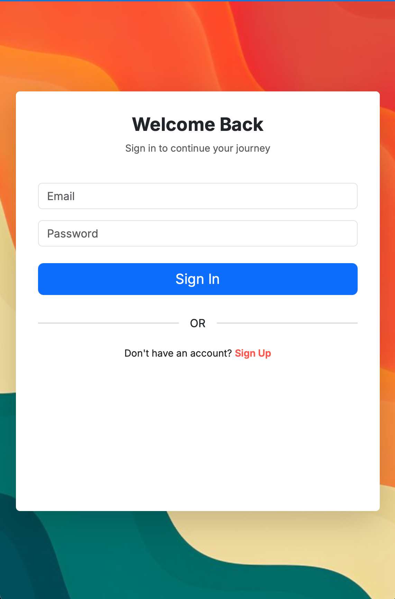
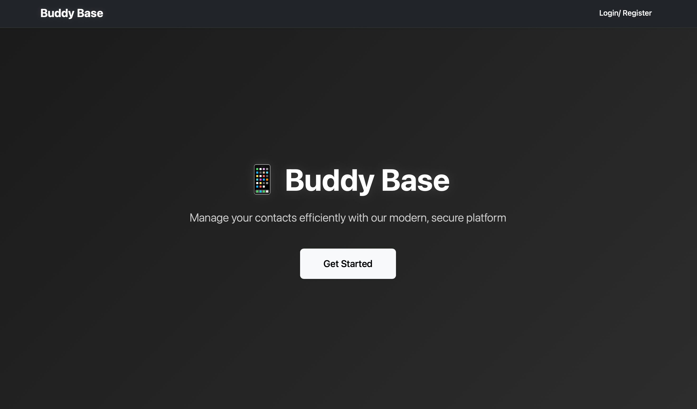
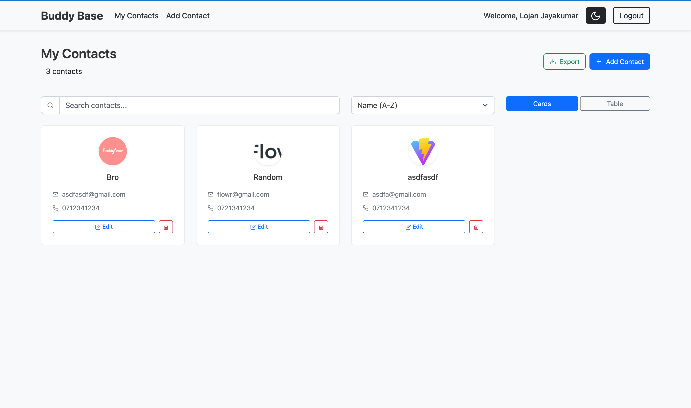
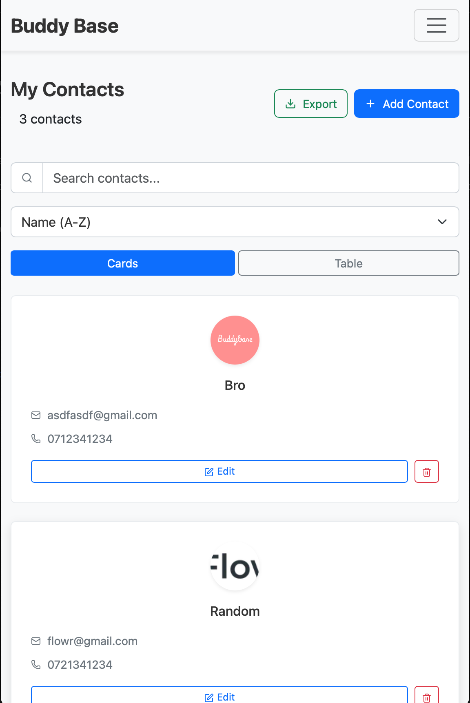
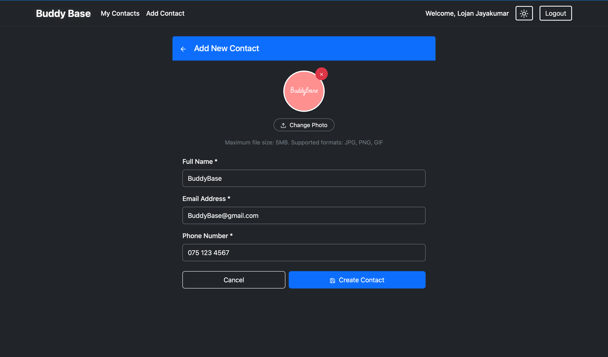
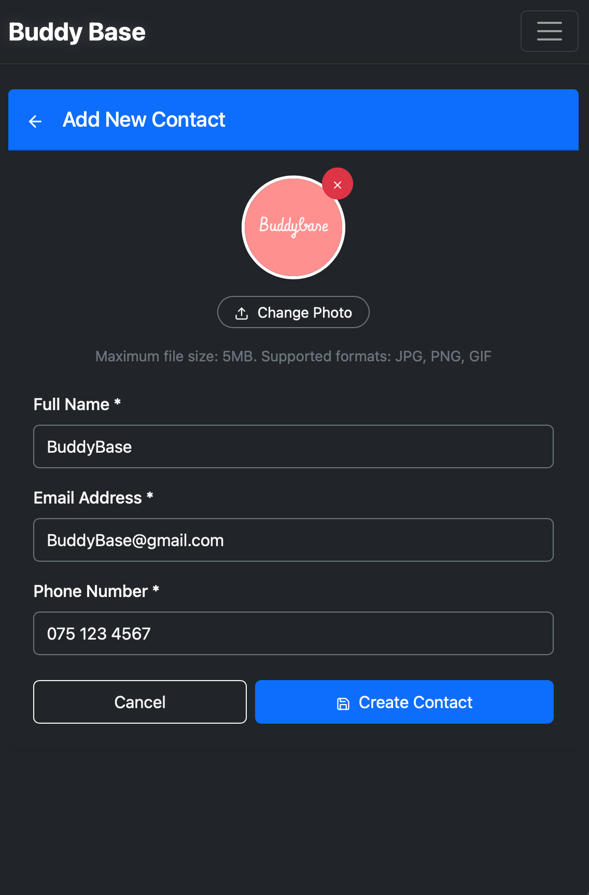
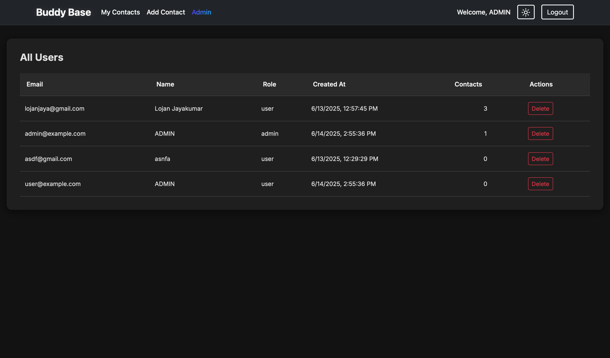
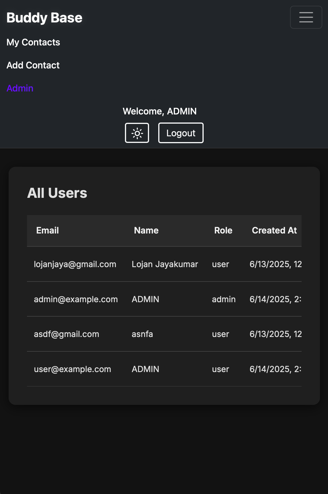

# BuddyBase Contact Management App

A full-stack, production-ready Contact Management Application built with **Nest.js**, **React**, and **PostgreSQL**. This project demonstrates advanced CRUD, authentication, role-based access, file uploads, full-text search, PWA support, and more.

---

## 📸 Screenshots



### Home Page


### Contact List



### Create Contact



### Admin Panel




---

## 📚 Table of Contents
- [Project Overview](#project-overview)
- [Features](#features)
- [Technologies Used](#technologies-used)
- [Project Structure](#project-structure)
- [Getting Started](#getting-started)
- [API Documentation](#api-documentation)
- [Authentication & Authorization](#authentication--authorization)
- [Frontend Features](#frontend-features)
- [Testing](#testing)
- [Docker Support](#docker-support)
- [Troubleshooting](#troubleshooting)
- [Contributing](#contributing)
- [FAQ](#faq)
- [Assessment Criteria](#assessment-criteria)

---

## 📌 Project Overview

BuddyBase is a secure, feature-rich contact management platform. Users can manage their own contacts, while admins have full control over all users and contacts. The app is mobile responsive, PWA-ready, and includes advanced features like CSV export, email notifications, and full-text search.

---

## ✅ Features

### Backend (Nest.js + PostgreSQL)
- Secure REST API with JWT authentication
- Full CRUD for contacts
- Role-based access (user/admin)
- File upload (profile photo)
- Pagination, sorting, filtering, and full-text search (PostgreSQL)
- Global error handling & validation (class-validator)
- TypeORM + migrations
- Email notifications (on contact creation)
- Export contacts as CSV

### Frontend (React)
- Responsive, modern UI (Bootstrap, dark/light mode)
- Auth (login/register, JWT session)
- Paginated, searchable, sortable contacts (table/cards)
- Contact photo upload & preview
- Edit/delete with confirmation
- State management (Context/Redux)
- PWA-ready (installable, offline support)

---

## 🛠️ Technologies Used
- **Backend:** Nest.js, TypeORM, PostgreSQL, class-validator, JWT, Multer, Nodemailer
- **Frontend:** React, React Router, React Context, Bootstrap, React Testing Library
- **Other:** Docker, Vite, Jest, Supertest

---

## 🗂️ Project Structure

### Backend
```
backend/
  src/
    admin/           # Admin controllers/services
    auth/            # Auth controllers/services/guards
    contact/         # Contact controllers/services/entities
    mailer/          # Email notification service
    users/           # User controllers/services/entities
    database/        # Migrations and seeders
    common/          # Global filters, interceptors, etc.
  test/              # Integration and e2e tests
  ...
```

### Frontend
```
frontend/
  src/
    components/      # React components (ContactList, ContactForm, etc.)
    context/         # Auth and theme context
    App.jsx          # Main app
    ...
  public/            # Static assets, PWA icons
  ...
```

---

## 🚀 Getting Started

### Prerequisites
- Node.js (v18+ recommended)
- PostgreSQL (v13+ recommended)
- npm or yarn
- (Optional) Docker

### 1. Clone the repository
```bash
git clone https://github.com/LojanJ/SwiftAI-Assessment.git
```

### 2. Backend Setup
```bash
cd backend
cp .env.example .env # Fill in your DB and SMTP credentials
npm install
npm run typeorm migration:run # Run DB migrations
npm run start:dev
```

#### **Environment Variables (.env) Example**
```
DATABASE_HOST=localhost
DATABASE_PORT=5432
DATABASE_USERNAME=postgres
DATABASE_PASSWORD=yourpassword
DATABASE_NAME=buddybase
JWT_SECRET=your_jwt_secret
SMTP_HOST=smtp.example.com
SMTP_PORT=587
SMTP_USER=youruser@example.com
SMTP_PASS=yourpassword
```

### 3. Frontend Setup
```bash
cd ../frontend
npm install
npm run dev
```

### 4. (Optional) Run with Docker
```bash
docker-compose up --build
```

---

## 🛠️ API Documentation

### **Authentication**
- `POST /auth/register` — Register a new user
  - **Body:** `{ "name": "John", "email": "john@example.com", "password": "secret" }`
  - **Response:** `{ "access_token": "...", "user": { ... } }`
- `POST /auth/login` — Login and receive JWT
  - **Body:** `{ "email": "john@example.com", "password": "secret" }`
  - **Response:** `{ "access_token": "...", "user": { ... } }`

### **Contacts**
- `POST /contacts` — Add a new contact (name, email, phone, photo)
  - **Body:** `multipart/form-data` (fields: name, email, phone, photo)
  - **Response:** Contact object
- `GET /contacts` — List user's contacts (pagination, search, sort)
  - **Query:** `?page=1&limit=10&search=John&sortBy=name&sortOrder=ASC`
  - **Response:** `{ data: [...], total, page, limit, totalPages }`
- `GET /contacts/:id` — Get a specific contact (ownership enforced)
- `PUT /contacts/:id` — Update a contact
- `DELETE /contacts/:id` — Delete a contact
- `GET /contacts/export` — Export contacts as CSV
  - **Response:** CSV file

### **Admin**
- `GET /admin/users` — List all users
- `GET /admin/contacts` — List all contacts
- `DELETE /admin/user/:id` — Delete a user
- `DELETE /admin/contact/:id` — Delete a contact

### **Search & Filtering**
- All list endpoints support `?search=`, `?page=`, `?limit=`, `?sortBy=`, `?sortOrder=`
- **Full-text search:** Uses PostgreSQL's `to_tsvector` and `plainto_tsquery` for advanced matching on name/email.

### **File Upload**
- Contacts can have a profile photo (stored on disk or S3/local)
- Use `multipart/form-data` for POST/PUT

### **Email Notifications**
- Users receive an email when they create a new contact (uses SMTP, see .env)

### **Error Handling**
- All errors return standardized JSON:
  ```json
  {
    "success": false,
    "status_code": 400,
    "timestamp": "2025-06-15T00:00:00.000Z",
    "path": "/contacts",
    "message": "Validation failed"
  }
  ```

---

## 🔐 Authentication & Authorization
- JWT-based auth (token in `Authorization: Bearer ...` header)
- Role-based access: `user` (own data), `admin` (all data)
- Protected routes via guards/middleware
- Admin endpoints require `admin` role

---

## 🧩 Frontend Features
- Login/register forms with validation
- JWT session management (stored securely)
- Paginated, searchable, sortable contacts
- Contact photo upload & preview
- Edit/delete with confirmation dialogs
- Responsive design, dark/light mode toggle
- PWA support (installable, offline-ready)
- Real-time feedback (toasts, spinners, error messages)

---

## 🧪 Testing (Not Prioritized)
- **Backend:** Jest + Supertest (unit & integration)
  - Run: `npm run test` and `npm run test:e2e`
- **Frontend:** React Testing Library
  - Run: `npm test`

---

## 🐳 Docker Support

To run the full stack with Docker:
```bash
docker-compose up --build
```
- Make sure your `.env` is set up before running Docker.

---

## 🛠️ Troubleshooting
- **Database connection errors:** Check your `.env` and ensure PostgreSQL is running.
- **SMTP/email issues:** Verify SMTP credentials and network access.
- **CORS errors:** Make sure frontend and backend URLs are correct.
- **File upload errors:** Check file size/type and upload directory permissions.
- **Docker issues:** Run `docker-compose down -v` to reset containers/volumes.

---

## 🤝 Contributing
1. Fork the repo and create your branch: `git checkout -b feature/your-feature`
2. Commit your changes: `git commit -am 'Add new feature'`
3. Push to the branch: `git push origin feature/your-feature`
4. Open a pull request

---

## ❓ FAQ
- **How do I reset the database?**
  - Run `npm run typeorm migration:revert` or drop/recreate the DB.
- **How do I change the JWT secret?**
  - Update `JWT_SECRET` in your `.env` and restart the backend.
- **How do I add more fields to contacts?**
  - Update the entity, DTO, and frontend forms accordingly.
- **How do I deploy this?**
  - Use Docker or deploy backend/frontend separately to your preferred cloud provider.

---

## 📝 Assessment Criteria

### **Backend (Nest.js)**
- Clean architecture (modules, services, controllers)
- Secure JWT auth and role-based access
- File upload and data validation
- Pagination, filtering, and sorting logic

### **Frontend (React)**
- Auth flow with protected routes
- Dynamic, clean UI with real-time feedback
- Responsive design and good UX
- State management and organized codebase

### **Overall**
- Code readability, comments, and organization
- Git commit history and proper version control
- Setup scripts or Docker support for local dev
- README with detailed instruction

---
